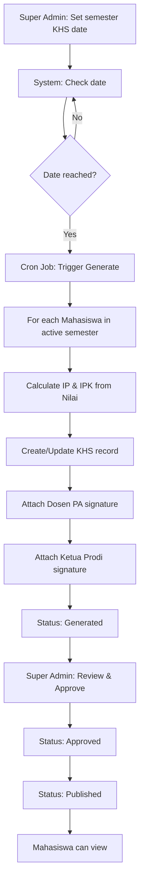

# 🚀 Implementation Plan - Major Features

## Overview
Dokumen ini berisi roadmap lengkap implementasi fitur-fitur baru yang kompleks untuk SIAKAD STAI Al-Fatih.

---

## ✅ Phase 1: Ruangan Daring/Online (COMPLETED)

### 1.1 Database & Model
- [x] Migration: `add_jenis_to_ruangans_table`
  - Add field `jenis` enum('offline', 'online')
- [x] Model Ruangan: add `jenis` to fillable
- [x] RuanganSeeder: add 5 ruangan online (ONLINE-1 s/d ONLINE-5)

### 1.2 Validation Logic
**Ruangan Offline:**
- Tidak boleh bentrok waktu sama sekali
- Check: `ruangan_id` + `hari` + `jam_mulai` + `jam_selesai`

**Ruangan Online:**
- Bisa overlap KECUALI mata kuliah yang SAMA
- Check: `ruangan_id` + `mata_kuliah_id` + `hari` + `jam_mulai` + `jam_selesai`

### 1.3 Implementation Details
**File:** `app/Http/Controllers/Admin/JadwalController.php` (or Operator)

```php
// Validation in store() and update()
$ruangan = Ruangan::find($request->ruangan_id);

if ($ruangan->jenis === 'offline') {
    // Existing logic - no overlap at all
    $conflictOffline = Jadwal::where('ruangan_id', $request->ruangan_id)
        ->where('hari', $request->hari)
        ->where('semester_id', $request->semester_id)
        ->where(function ($query) use ($request) {
            $query->whereBetween('jam_mulai', [$request->jam_mulai, $request->jam_selesai])
                ->orWhereBetween('jam_selesai', [$request->jam_mulai, $request->jam_selesai])
                ->orWhere(function ($q) use ($request) {
                    $q->where('jam_mulai', '<=', $request->jam_mulai)
                      ->where('jam_selesai', '>=', $request->jam_selesai);
                });
        })
        ->exists();

    if ($conflictOffline) {
        return back()->withErrors(['ruangan_id' => 'Ruangan offline sudah dipakai di waktu tersebut.']);
    }
} else {
    // New logic for online rooms - can overlap except same mata_kuliah
    $conflictOnline = Jadwal::where('ruangan_id', $request->ruangan_id)
        ->where('mata_kuliah_id', $request->mata_kuliah_id) // Same course not allowed
        ->where('hari', $request->hari)
        ->where('semester_id', $request->semester_id)
        ->where(function ($query) use ($request) {
            $query->whereBetween('jam_mulai', [$request->jam_mulai, $request->jam_selesai])
                ->orWhereBetween('jam_selesai', [$request->jam_mulai, $request->jam_selesai])
                ->orWhere(function ($q) use ($request) {
                    $q->where('jam_mulai', '<=', $request->jam_mulai)
                      ->where('jam_selesai', '>=', $request->jam_selesai);
                });
        })
        ->exists();

    if ($conflictOnline) {
        return back()->withErrors(['ruangan_id' => 'Mata kuliah yang sama sudah ada di ruangan online pada waktu tersebut.']);
    }
}
```

---

## 🔄 Phase 2: Dosen - Mata Kuliah Assignment (IN PROGRESS)

### 2.1 Database & Model
- [x] Migration: `create_dosen_mata_kuliah_table` (pivot table)
- [x] Model Dosen: add `mataKuliahs()` relation
- [ ] DosenSeeder: auto-assign mata kuliah based on program studi

### 2.2 Admin Interface - Edit Dosen
**Requirements:**
1. Pilih program studi (dropdown atau tabs)
2. Tampilkan mata kuliah dari prodi tersebut (checkboxes)
3. Ada tombol "Pilih Semua" per prodi
4. Bisa pilih spesifik mata kuliah tertentu
5. Save assignment ke `dosen_mata_kuliah` table

**UI Flow:**
```
Edit Dosen Page
├─ Basic Info (NIDN, Nama, dll)
├─ Program Studi Assignment (Checkboxes) ← Existing
└─ Mata Kuliah per Prodi (NEW)
   ├─ [Dropdown/Tab] Pilih Prodi: PAI
   ├─ Mata Kuliah PAI:
   │  ├─ [ ] Pilih Semua
   │  ├─ [x] PAI-101 - Pendidikan Pancasila
   │  ├─ [x] PAI-102 - Bahasa Inggris
   │  └─ [ ] PAI-103 - Aqidah
   └─ [Save Button]
```

**Implementation Plan:**
- File: `resources/views/admin/users/edit.blade.php`
- Add section after program studi checkboxes
- Use Alpine.js or AJAX to load mata kuliah when prodi selected
- Submit array `mata_kuliah_ids[]` to controller

**Controller Update:**
- File: `app/Http/Controllers/Admin/SuperAdminController.php`
- In `update()` method, sync `$user->dosen->mataKuliahs()->sync($request->mata_kuliah_ids)`

### 2.3 Filter Jadwal, Nilai, KHS by Dosen Assignment

**Jadwal (Dosen):**
- Filter mata kuliah dropdown: only show assigned ones
- Query: `$dosen->mataKuliahs()->where('program_studi_id', $prodiId)->get()`

**Nilai (Dosen):**
- Filter mata kuliah: only show assigned ones
- Filter mahasiswa: only from assigned prodi

**KHS (Dosen):**
- Show KHS of mahasiswa where dosen is "dosen_wali_id"
- Filter by assigned prodi

---

## 🎓 Phase 3: KHS Auto-Generate System (PLANNED)

### 3.1 System Architecture

**Role Distribution:**
| Role | Access | Description |
|------|--------|-------------|
| **Super Admin** | Full Control | Generate KHS, Settings, Approve |
| **Operator** | Helper | Assist generate, no approve |
| **Dosen** | Read-Only | View KHS mahasiswa bimbingan |
| **Mahasiswa** | Read-Only | View own KHS |

### 3.2 Database Changes

**Add to `semesters` table:**
```php
$table->date('khs_generate_date')->nullable();
$table->boolean('khs_auto_generate')->default(false);
$table->boolean('khs_show_ketua_prodi_signature')->default(true);
$table->boolean('khs_show_dosen_pa_signature')->default(true);
$table->enum('khs_status', ['draft', 'generated', 'approved', 'published'])->default('draft');
```

**KHS Table Structure (existing - verify):**
- mahasiswa_id
- semester_id
- ip (Index Prestasi semester ini)
- ipk (Index Prestasi Kumulatif)
- total_sks_semester
- total_sks_kumulatif
- status (lulus/tidak lulus semester)
- dosen_pa_id (dosen wali/pembimbing akademik)
- ketua_prodi_id
- generated_at
- approved_at
- approved_by

### 3.3 KHS Generation Flow



### 3.4 Implementation Steps

#### Step 3.4.1: Migration - Add KHS Settings to Semesters
```bash
php artisan make:migration add_khs_settings_to_semesters_table
```

#### Step 3.4.2: Update Semester Model
Add fillable fields and casts

#### Step 3.4.3: Create KHS Generator Service
```php
// app/Services/KhsGeneratorService.php
class KhsGeneratorService
{
    public function generateForSemester(Semester $semester)
    {
        $mahasiswas = Mahasiswa::where('status', 'aktif')->get();
        
        foreach ($mahasiswas as $mahasiswa) {
            $this->generateKhsForMahasiswa($mahasiswa, $semester);
        }
    }

    private function generateKhsForMahasiswa(Mahasiswa $mahasiswa, Semester $semester)
    {
        // Get all nilai for this mahasiswa in this semester
        $nilais = Nilai::where('mahasiswa_id', $mahasiswa->id)
                       ->where('semester_id', $semester->id)
                       ->get();

        // Calculate IP (current semester)
        $totalSks = 0;
        $totalNilai = 0;
        
        foreach ($nilais as $nilai) {
            $sks = $nilai->mataKuliah->sks;
            $bobot = $this->getBobot($nilai->nilai_huruf);
            $totalSks += $sks;
            $totalNilai += ($sks * $bobot);
        }
        
        $ip = $totalSks > 0 ? $totalNilai / $totalSks : 0;

        // Calculate IPK (cumulative)
        $allNilais = Nilai::where('mahasiswa_id', $mahasiswa->id)
                          ->whereHas('semester', function($q) use ($semester) {
                              $q->where('tahun_akademik', '<=', $semester->tahun_akademik);
                          })
                          ->get();
        
        $totalSksKumulatif = 0;
        $totalNilaiKumulatif = 0;
        
        foreach ($allNilais as $nilai) {
            $sks = $nilai->mataKuliah->sks;
            $bobot = $this->getBobot($nilai->nilai_huruf);
            $totalSksKumulatif += $sks;
            $totalNilaiKumulatif += ($sks * $bobot);
        }
        
        $ipk = $totalSksKumulatif > 0 ? $totalNilaiKumulatif / $totalSksKumulatif : 0;

        // Get Dosen PA and Ketua Prodi
        $dosenPaId = $mahasiswa->dosen_wali_id;
        $ketuaProdiId = $mahasiswa->programStudi->ketua_prodi_id;

        // Create or update KHS
        Khs::updateOrCreate(
            [
                'mahasiswa_id' => $mahasiswa->id,
                'semester_id' => $semester->id,
            ],
            [
                'ip' => round($ip, 2),
                'ipk' => round($ipk, 2),
                'total_sks_semester' => $totalSks,
                'total_sks_kumulatif' => $totalSksKumulatif,
                'dosen_pa_id' => $dosenPaId,
                'ketua_prodi_id' => $ketuaProdiId,
                'generated_at' => now(),
                'status' => 'generated',
            ]
        );
    }

    private function getBobot($nilaiHuruf)
    {
        return match($nilaiHuruf) {
            'A' => 4.0,
            'A-' => 3.7,
            'B+' => 3.3,
            'B' => 3.0,
            'B-' => 2.7,
            'C+' => 2.3,
            'C' => 2.0,
            'D' => 1.0,
            'E' => 0.0,
            default => 0.0,
        };
    }
}
```

#### Step 3.4.4: Create Artisan Command for Manual Trigger
```bash
php artisan make:command GenerateKhs
```

```php
// app/Console/Commands/GenerateKhs.php
protected $signature = 'khs:generate {semester_id}';

public function handle()
{
    $semester = Semester::findOrFail($this->argument('semester_id'));
    
    $this->info("Generating KHS for semester: {$semester->nama_semester}");
    
    $service = app(KhsGeneratorService::class);
    $service->generateForSemester($semester);
    
    $this->info('KHS generation completed!');
}
```

#### Step 3.4.5: Setup Cron Job (Laravel Scheduler)
```php
// app/Console/Kernel.php
protected function schedule(Schedule $schedule)
{
    // Check every day at 00:00 if any semester needs KHS generation
    $schedule->call(function () {
        $semesters = Semester::where('khs_auto_generate', true)
                            ->where('khs_generate_date', now()->toDateString())
                            ->where('khs_status', '!=', 'generated')
                            ->get();

        foreach ($semesters as $semester) {
            Artisan::call('khs:generate', ['semester_id' => $semester->id]);
            $semester->update(['khs_status' => 'generated']);
        }
    })->daily();
}
```

#### Step 3.4.6: Update KHS Controller - Move to Super Admin

**Current:** `app/Http/Controllers/Dosen/KhsController.php`
**New:** 
- `app/Http/Controllers/Admin/KhsManagementController.php` (Super Admin)
- `app/Http/Controllers/Dosen/KhsViewController.php` (Read-only for Dosen)
- `app/Http/Controllers/Mahasiswa/KhsController.php` (Read-only for Mahasiswa)

#### Step 3.4.7: Create KHS Setting Page (Super Admin)
Route: `/admin/semesters/{id}/khs-settings`

**Form Fields:**
- KHS Generate Date (date picker)
- Auto Generate (checkbox)
- Show Ketua Prodi Signature (checkbox)
- Show Dosen PA Signature (checkbox)

**Actions:**
- Save Settings
- Manual Trigger Generate (button)
- Approve All (button)
- Publish (button)

### 3.5 KHS View/Print

**PDF Template with Signature:**
```
┌─────────────────────────────────────────────┐
│     KARTU HASIL STUDI (KHS)                 │
│   STAI AL-FATIH TANGERANG                   │
└─────────────────────────────────────────────┘

Nama    : [Nama Mahasiswa]
NIM     : [NIM]
Prodi   : [Program Studi]
Semester: [Semester]

┌──────────────────────────────────────────────────┐
│ Kode │ Mata Kuliah │ SKS │ Nilai │ Bobot │ N×S  │
├──────┼─────────────┼─────┼───────┼───────┼──────┤
│ ...  │ ...         │ ... │ ...   │ ...   │ ...  │
└──────────────────────────────────────────────────┘

IP Semester  : [IP]
IPK          : [IPK]
Total SKS    : [Total]

[if khs_show_dosen_pa_signature]
Dosen PA                        
                                
                                
[Nama Dosen PA]                 
NIDN: [NIDN]                    
[/if]

[if khs_show_ketua_prodi_signature]
                   Ketua Program Studi
                   
                   
                   [Nama Ketua Prodi]
                   NIDN: [NIDN]
[/if]
```

---

## 📝 Phase 4: Additional Enhancements (FUTURE)

### 4.1 Dosen PA (Pembimbing Akademik) Management
- Assign dosen as PA to specific mahasiswa
- PA can monitor academic progress
- PA approval for KRS

### 4.2 Notification System
- Email/SMS when KHS is published
- Notification to Dosen PA for review
- Alert for low IPK students

### 4.3 Academic Analytics
- Dashboard for Ketua Prodi
- Student performance trends
- Dosen teaching effectiveness

### 4.4 Mobile App Integration
- API for mobile apps
- Push notifications
- Mobile-friendly KHS view

---

## 🚦 Implementation Priority

### IMMEDIATE (This Week):
1. ✅ Ruangan Online Logic
2. ⏳ Dosen - Mata Kuliah Assignment
3. ⏳ Jadwal Validation Update

### SHORT TERM (Next 2 Weeks):
4. KHS Database Structure Updates
5. KHS Generator Service
6. KHS Manual Trigger (Artisan Command)

### MEDIUM TERM (Next Month):
7. KHS Auto-Generate (Cron)
8. KHS Management UI (Super Admin)
9. KHS View for Mahasiswa & Dosen
10. PDF Export with Signatures

### LONG TERM (Next Quarter):
11. Analytics Dashboard
12. Notification System
13. Mobile API

---

## 📚 Documentation & Testing

### Documentation Needed:
- User Manual: How to assign mata kuliah to dosen
- User Manual: How to configure KHS settings
- Admin Guide: KHS generation process
- API Documentation (if mobile integration)

### Testing Checklist:
- [ ] Unit Tests: KhsGeneratorService
- [ ] Integration Tests: KHS generation flow
- [ ] UI Tests: Edit dosen form with mata kuliah selector
- [ ] Load Tests: KHS generation for 1000+ mahasiswa
- [ ] Edge Cases: Empty nilai, incomplete data

---

## 🔐 Security Considerations

1. **Authorization:** Ensure only authorized roles can generate KHS
2. **Data Integrity:** Validate all inputs before calculation
3. **Audit Log:** Track who generates/approves KHS
4. **Backup:** Backup before bulk KHS generation
5. **Rollback:** Ability to rollback failed generation

---

## 📞 Support & Maintenance

### Monitoring:
- Log all KHS generation activities
- Alert on generation failures
- Monitor performance (generation time)

### Maintenance:
- Regular cleanup of old draft KHS
- Archive published KHS
- Database optimization

---

## ✅ Progress Tracking

Current Status: **Phase 2 - In Progress**

- [x] Phase 1: Ruangan Online - COMPLETED
- [⏳] Phase 2: Dosen - Mata Kuliah - IN PROGRESS (50%)
- [ ] Phase 3: KHS Auto-Generate - PLANNED
- [ ] Phase 4: Additional Features - FUTURE

Last Updated: 2025-11-13
